# VoltStream Documentation (Week 2)

# Project Overview

VoltStream is an energy monitoring and management application created to track device usage, monitor analytics, view billing information, and manage connected devices from a single dashboard.

The project combines frontend and backend technologies to create a complete full-stack application with cloud deployment support.

The application is designed in a way where users can monitor smart devices, analyze usage trends, and understand energy consumption patterns through visual dashboards and reports.

# Hosting URLs

## Backend URL

```plaintext
https://voltstream-yethishwar-backend-536159688445.us-central1.run.app
```

Backend deployed successfully using Google Cloud Run.

---

## Frontend URL

```plaintext
https://yethishwar-voltstream.web.app/
```

Frontend deployed successfully using Firebase Hosting.

---

# Use Case

The project can be used in homes, offices, or small businesses where multiple devices or sensors are connected to utility systems.

Instead of checking different systems separately, users can monitor everything from one interface.

Users can:
- View all connected devices
- Track current usage and activity
- Analyze consumption patterns using charts
- View billing-related information
- Add or manage devices
- Understand technical terms and metrics used inside the application

The main purpose of the project is to simplify energy monitoring and make usage data easier to understand.

---

# Project Architecture

The project follows a frontend-backend architecture.

The frontend handles everything users interact with in the browser such as pages, navigation, charts, and dashboards.

The backend handles API requests, business logic, and data processing.

It sends data to the frontend whenever users interact with the application.
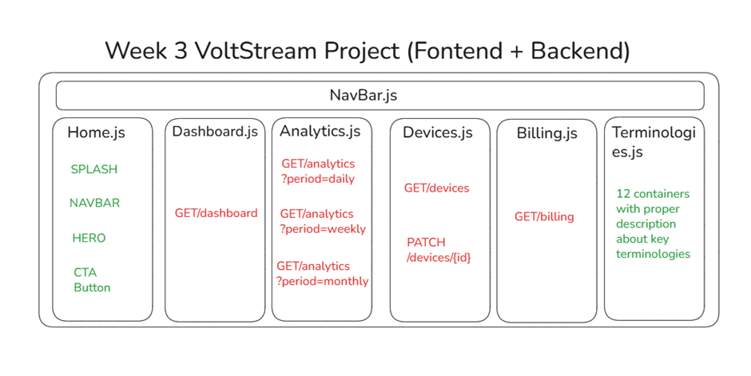

## Project Structure


```plaintext
VoltStream/
│
├── frontend/
│
├── backend/
│
└── README.md
```

The frontend and backend work independently but communicate through API requests.

---

# Frontend Structure
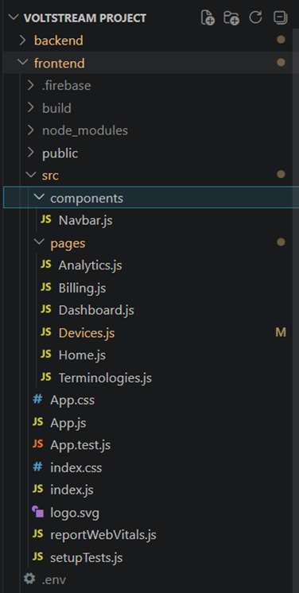
The frontend is developed using React and Tailwind CSS.

It contains different pages and reusable components that build the user interface.

## Main Frontend Files

### public/index.html

This is the base HTML file loaded in the browser.

### src/index.js

This file starts the React application and connects React with the HTML root element.

### src/App.js

This acts as the main application container. It handles routing and page rendering.

### src/components/Navbar.js

This contains the navigation bar used across different pages.

---

# Frontend Pages

## Home Page

Acts as the landing page or welcome screen.

## Dashboard Page

Displays overall device information, quick statistics, and summaries.

## Analytics Page

Shows charts, trends, and visual analysis of energy usage.

## Billing Page

Displays billing details, usage summaries, and cost-related information.

## Devices Page

Allows users to manage connected devices and view device details.

## Terminologies Page

Contains explanations of technical terms and application-related definitions.

---

# Styling & Configuration

## Tailwind CSS

Used for responsive styling and UI design.

## package.json

Contains frontend dependencies and scripts such as:

```bash
npm start
npm run build
```

## firebase.json

Used for Firebase Hosting deployment configuration.

---

# Backend Structure


The backend is developed using Python.

It handles:
- API creation
- Request processing
- Data communication
- Backend logic

## Main Backend Files

### main.py

This is the core backend file where APIs and request handling logic are written.

Example functionalities include:
- Fetching device data
- Returning analytics information
- Sending billing details
- Handling user requests

### requirements.txt

Contains Python dependencies required for the backend.

### Dockerfile

Used to containerize the backend application for deployment.

---

# Data Workflow

The frontend and backend communicate through APIs.

The workflow is:

1. User opens the frontend application
2. React renders the required page
3. Frontend sends API requests to the backend
4. Backend processes the request
5. Backend returns data in JSON format
6. Frontend receives the response
7. UI updates dynamically with the received data

This workflow happens continuously whenever users interact with dashboards, analytics, billing, or devices.

---

# Local Development Workflow

# Running Backend Locally

```bash
cd backend
pip install -r requirements.txt
python main.py
```

The backend starts running on a local server.

---

# Running Frontend Locally

```bash
cd frontend
npm install
npm start
```

The frontend starts running in the browser using the React development server.

---

# Frontend Output

# Opening Splash Page

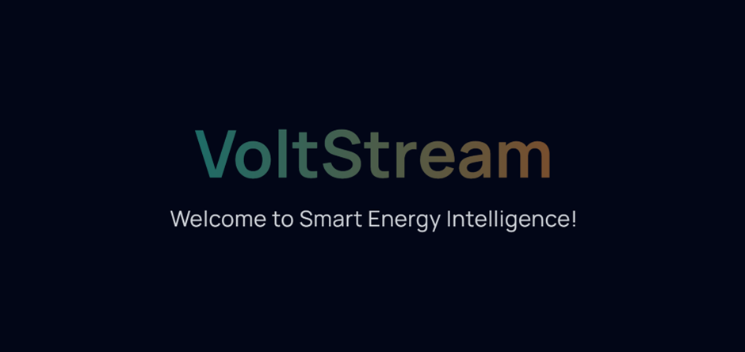

---

# Home Page

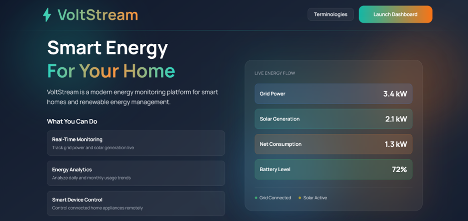

---

# Terminologies Page

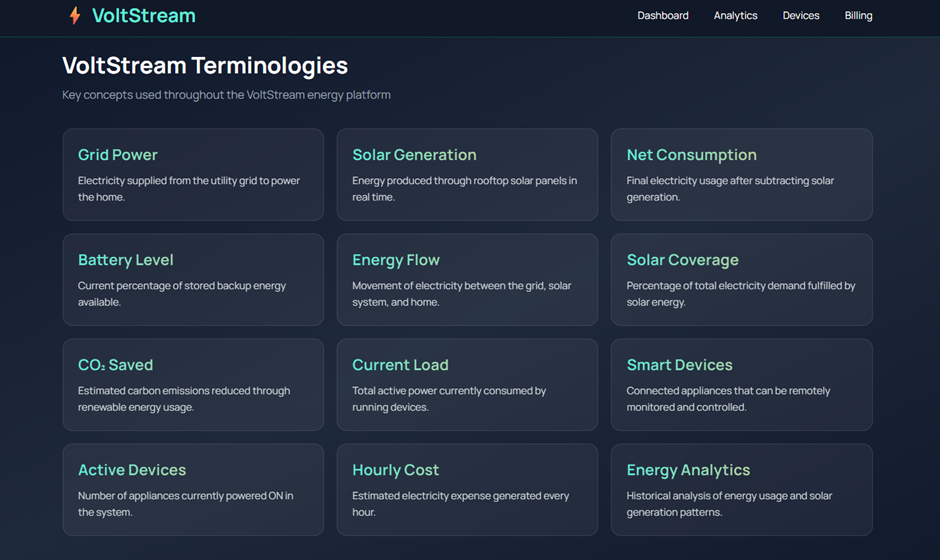
---

# Dashboard Page

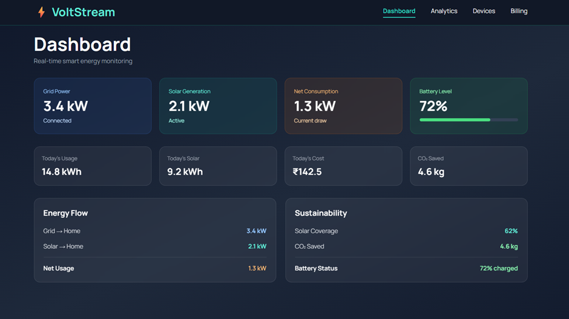
---

# Analytics Page

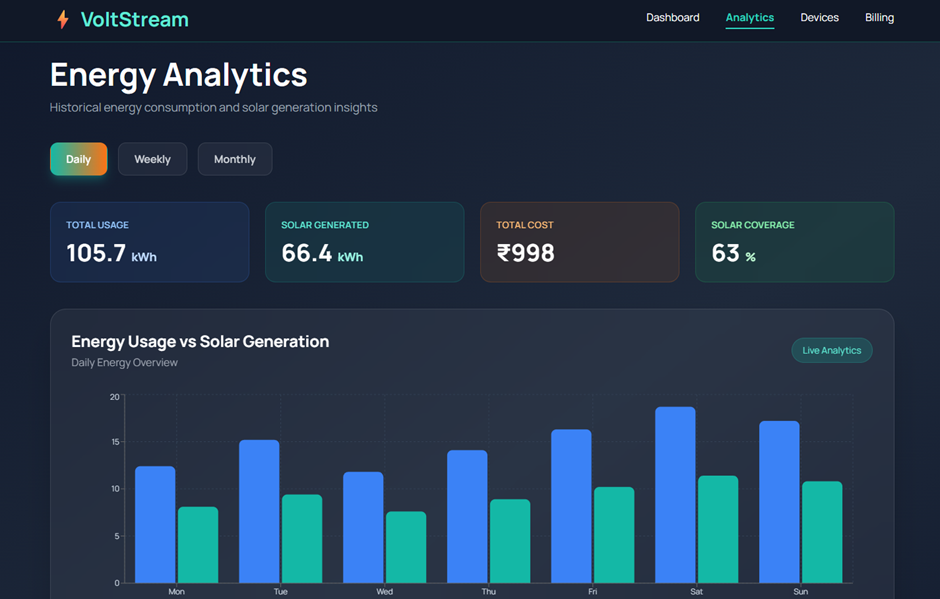
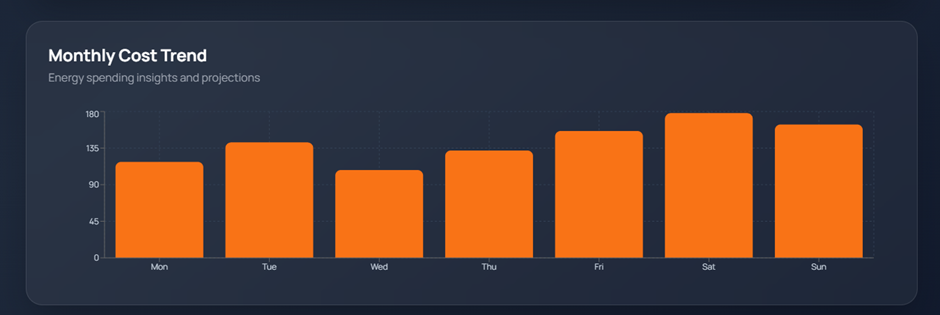
---

# Devices Page

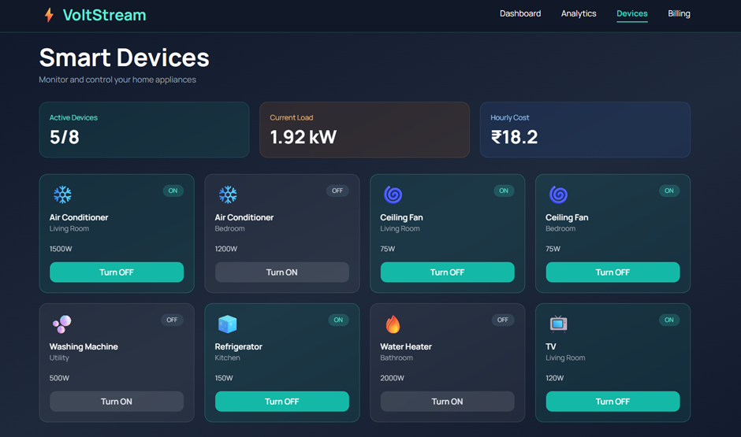
---

# Billing Page

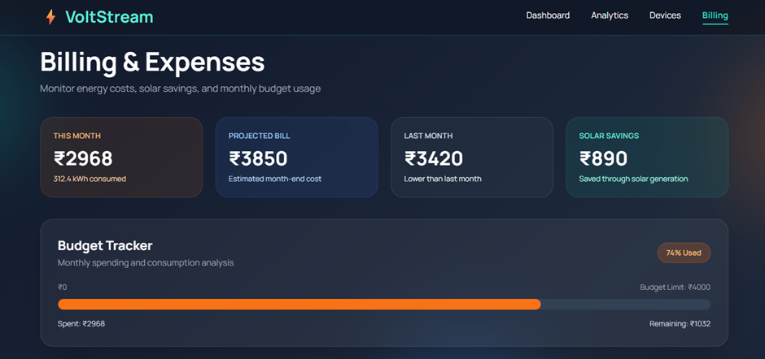
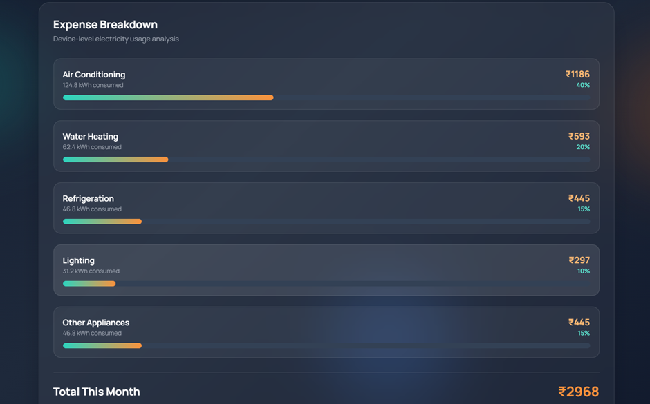
---

# Backend Output

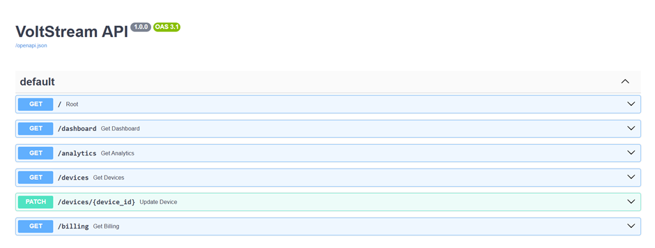
---

# Deployment Workflow

# Backend Deployment using Docker + Google Cloud Run

## Step 1 – Create Backend Files

First, the backend required:
- main.py
- requirements.txt
- Dockerfile

The `requirements.txt` file contains Python dependencies.

The `Dockerfile` is used to create a Docker image for deployment.

---

## Step 2 – Login to Google Cloud

```bash
gcloud auth login
```

This opens a browser and connects the local system with the Google Cloud account.

---

## Step 3 – Select Google Cloud Project

```bash
gcloud config set project voltstream-yethishwar
```

OR

```bash
gcloud config set project quixotic-dynamo-495704-k4
```

This sets the active Google Cloud project.

---

## Step 4 – Enable Required Services

These services are needed for deployment.

```bash
gcloud services enable run.googleapis.com
```

```bash
gcloud services enable artifactregistry.googleapis.com
```

```bash
gcloud services enable cloudbuild.googleapis.com
```

---

## Step 5 – Build Docker Image

Move inside backend folder:

```bash
cd backend
```

Build Docker image:

```bash
docker build -t voltstream-yethishwar-backend .
```

This creates the backend Docker image locally.

---

## Step 6 – Create Artifact Registry Repository

```bash
gcloud artifacts repositories create my-repo \
--repository-format=docker \
--location=us-central1
```

OR

```bash
gcloud artifacts repositories create voltstream-repo \
--repository-format=docker \
--location=asia-south1
```

Artifact Registry stores Docker images in Google Cloud.

---

## Step 7 – Configure Docker Authentication

Initially the following error occurred:

```plaintext
Unauthenticated request.
artifactregistry.repositories.uploadArtifacts
```

This happened because Docker authentication was not configured properly.

It was fixed using:

```bash
gcloud auth configure-docker asia-south1-docker.pkg.dev
```

OR

```bash
gcloud auth configure-docker us-central1-docker.pkg.dev
```

This connected Docker with Google Cloud authentication.

---

## Step 8 – Tag Docker Image

```bash
docker tag voltstream-yethishwar-backend us-central1-docker.pkg.dev/voltstream-yethishwar/my-repo/voltstream-yethishwar-backend
```

OR

```bash
docker tag voltstream-backend asia-south1-docker.pkg.dev/quixotic-dynamo-495704-k4/voltstream-repo/voltstream-backend
```

This prepares the image for cloud upload.

---

## Step 9 – Push Docker Image to Artifact Registry

```bash
docker push us-central1-docker.pkg.dev/voltstream-yethishwar/my-repo/voltstream-yethishwar-backend
```

OR

```bash
docker push asia-south1-docker.pkg.dev/quixotic-dynamo-495704-k4/voltstream-repo/voltstream-backend
```

You successfully pushed Docker images to Artifact Registry.

---

## Step 10 – Deploy Backend to Cloud Run

```bash
gcloud run deploy voltstream-yethishwar-backend \
--image us-central1-docker.pkg.dev/voltstream-yethishwar/my-repo/voltstream-yethishwar-backend \
--platform managed \
--region us-central1 \
--allow-unauthenticated
```

OR

```bash
gcloud run deploy voltstream-backend \
--image asia-south1-docker.pkg.dev/quixotic-dynamo-495704-k4/voltstream-repo/voltstream-backend \
--platform managed \
--region asia-south1 \
--allow-unauthenticated
```

Cloud Run successfully deployed the backend.

Generated service URLs:

```plaintext
https://voltstream-backend-235566209668.asia-south1.run.app
```

```plaintext
https://voltstream-yethishwar-backend-536159688445.us-central1.run.app
```

---

# Local Backend Testing

```bash
python -m uvicorn main:app --reload
```

Backend started locally on:

```plaintext
http://127.0.0.1:8000
```

The logs showed:
- Application startup complete
- GET requests working
- Auto reload working after file changes

This confirmed backend APIs were functioning correctly before deployment.

---

# Frontend Deployment using React + Firebase

## Step 1 – Run Frontend Locally

```bash
cd frontend
npm start
```

Frontend successfully started at:

```plaintext
http://localhost:3000
```

---

## Step 2 – Install Firebase CLI

```bash
npm install -g firebase-tools
```

This installs Firebase deployment commands.

---

## Step 3 – Login to Firebase

```bash
firebase login
```

This connects Firebase CLI with Google account.

---

## Step 4 – Initialize Firebase

```bash
firebase init
```

During setup:
- Hosting option selected
- Build folder selected
- React SPA configuration enabled

---

## Step 5 – Configure Build Directory

Set public directory as:

```plaintext
build
```

This tells Firebase to deploy React production files.

---

## Step 6 – Create Production Build

```bash
npm run build
```

This creates optimized production files inside:

```plaintext
frontend/build
```

---

## Step 7 – Deploy Frontend

```bash
firebase deploy
```

OR

```bash
firebase deploy --only hosting
```

Firebase uploads the React build files and provides a live frontend URL.

---

# Technologies Used

## Frontend
- React
- Tailwind CSS
- Firebase Hosting
- Node.js
- npm

## Backend
- Python
- Docker
- Google Cloud Run

---

# Learning & Understanding

This project helped in understanding:
- React project structure
- Component-based frontend development
- Routing and navigation
- Tailwind CSS styling
- Backend API creation
- Frontend-backend communication
- Docker basics
- Firebase deployment
- Google Cloud deployment
- Production build workflows

---

# Complete Workflow Followed

The overall workflow became:

1. Create frontend pages
2. Create backend APIs
3. Connect frontend with backend
4. Test locally
5. Build Docker image
6. Configure Google Cloud
7. Push image to Artifact Registry
8. Deploy backend using Cloud Run
9. Build React frontend
10. Configure Firebase Hosting
11. Generate production build
12. Deploy frontend using Firebase
13. Connect frontend with deployed backend API

---

# Conclusion

VoltStream provided practical understanding of full-stack application development using React, Python, Docker, Firebase, and Google Cloud Run.

The project helped in understanding frontend-backend integration, deployment workflows, cloud hosting, Docker image management, and production-level application deployment.


